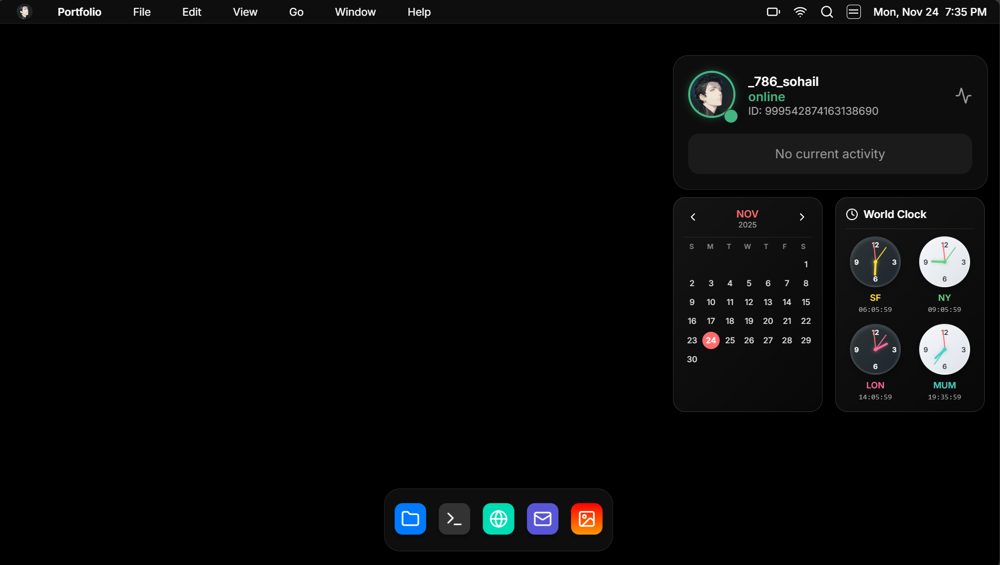

#  Portfolio OS

> **An immersive, interactive, and fully functional macOS-inspired portfolio website built with React.**



[](https://reactjs.org/)
[](https://vitejs.dev/)
[](https://www.framer.com/motion/)
[](https://threejs.org/)
[](LICENSE)

---

## 📖 Introduction

**Portfolio OS** transforms the traditional static portfolio into a dynamic, desktop-like experience. Inspired by macOS, it features a fully functional window manager, dock, and suite of applications that allow visitors to explore your work, skills, and contact information in an engaging way.

Whether you're a developer, designer, or creative, this template provides a unique platform to showcase your personality and technical prowess.

---

## ✨ Features

### 🖥️ Desktop Environment
- **Window Management**: Drag, minimize, maximize, and close windows with smooth animations.
- **Dock**: Iconic macOS-style dock with magnification effects.
- **Top Bar**: Functional menu bar with clock, battery, wifi, and control center.
- **Context Menus**: Right-click on the desktop for quick actions.
- **Theming**: Automatic Light/Dark mode switching based on system preference, with dynamic wallpapers.

### 📱 Applications
- **Safari 🌍**: A browser-within-a-browser to showcase your projects with rich previews and filtering.
- **Terminal ⌨️**: Interactive command-line interface. Try `help`, `ls`, `whoami`, and `matrix`!
- **Mail ✉️**: Fully functional contact form integrated with **EmailJS**. Includes Inbox, Sent, and Trash folders.
- **Photos 🖼️**: Responsive image gallery with a beautiful grid layout and full-screen lightbox view.
- **Finder 📂**: Navigate through your "files" and portfolio assets.
- **Settings ⚙️**: Customize the OS appearance and view system settings.
- **About This Mac **: View system specifications and your personal bio.

### ⚡ System Functions
- **Sleep Mode**: Turns the screen black until you wake it up (mouse move/key press).
- **Shut Down**: Simulates a system shutdown.
- **Widgets**: Interactive Desktop widgets including Calendar, World Clock, and Discord Status.

---

## 🚀 Getting Started

Follow these steps to get your Portfolio OS running locally.

### Prerequisites
- **Node.js** (v18 or higher)
- **npm** or **yarn**

### Installation

1.  **Clone the repository**
    ```bash
    git clone https://github.com/your-username/portfolio-os.git
    cd portfolio-os
    ```

2.  **Install dependencies**
    ```bash
    npm install
    ```

3.  **Set up Environment Variables**
    Create a `.env` file in the root directory and add your EmailJS keys (for the Mail app):
    ```env
    VITE_EMAILJS_SERVICE_ID=your_service_id
    VITE_EMAILJS_TEMPLATE_ID=your_template_id
    VITE_EMAILJS_PUBLIC_KEY=your_public_key
    ```

4.  **Run the development server**
    ```bash
    npm run dev
    ```

5.  **Open in Browser**
    Visit `http://localhost:5173` to see your new portfolio!

---

## 🎨 Customization

Make this portfolio your own by editing the following files:

### 1. Personal Information & Projects
-   **Projects**: Edit `src/apps/Safari.jsx` to update the `projects` array with your own work, images, and links.
-   **Bio/About**: Update `src/apps/About.jsx` with your personal details.
-   **Contact Info**: Update `src/apps/Mail.jsx` to reflect your email address and contact details.

### 2. Visuals
-   **Wallpapers**: Change the background images in `src/components/os/Desktop.jsx`.
-   **Logo**: Replace `public/assets/logo.png` with your own avatar or logo.
-   **Icons**: The project uses `lucide-react`. You can easily swap icons in `src/components/os/Dock.jsx` or other components.

### 3. Discord Status
-   To use the live Discord status widget, you'll need your Discord User ID. Update the ID in `src/components/DiscordStatus.jsx`. *Note: You must be in the Lanyard Discord server for this to work.*

---

## 📂 Project Structure

```
portfolio-os/
├── public/              # Static assets (images, icons)
├── src/
│   ├── apps/            # Application components (Safari, Mail, Terminal, etc.)
│   ├── components/
│   │   ├── os/          # OS UI components (Desktop, Dock, TopBar, Window)
│   │   └── ...          # Widgets and shared components
│   ├── context/         # React Context (OS state management)
│   ├── hooks/           # Custom hooks
│   ├── App.jsx          # Main entry point
│   └── main.jsx         # React DOM rendering
├── .env                 # Environment variables
└── package.json         # Dependencies and scripts
```

---

## 🤝 Contributing

Contributions are welcome! If you have ideas for new apps, features, or bug fixes:

1.  Fork the repository.
2.  Create a new branch (`git checkout -b feature/AmazingFeature`).
3.  Commit your changes (`git commit -m 'Add some AmazingFeature'`).
4.  Push to the branch (`git push origin feature/AmazingFeature`).
5.  Open a Pull Request.

---

## 📜 License

Distributed under the MIT License. See `LICENSE` for more information.

---

<div align="center">
  <p>Built with ❤️ by <b>Sohail</b></p>
  <p>
    <a href="https://github.com/sohail78692">GitHub</a> •
    <a href="https://twitter.com/sohail786akh">Twitter</a> •
    <a href="https://www.linkedin.com/in/sohail-akhtar-49229032a/">LinkedIn</a>
  </p>
</div>
